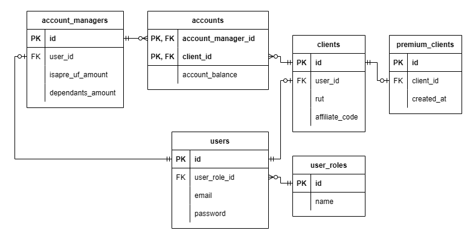

# Database Challenge

## Uso

- Revisa el archivo "index.drawio" con draw.io o en la sección "Solución" de este readme.

## Instrucciones

- Dibujar diagrama ERD en base a los requerimientos.
- El modelo debe:
  - Tener flechas, cajas (UML), datos, llaves foráneas y primarias.
  - Estar en inglés.
  - No debe tener redundancia de datos.
  - Sólo debe contener las funcionalidades necesarias para cumplir lo solicitado.
  - No es necesario que tenga los tipos de datos.

## Caso

- Esta es una aplicación para gestionar un banco, en la cual los clientes pueden ver los saldos de sus cuentas, y los ejecutivos del banco, por su lado, también pueden ver los saldos de las cuentas que tienen asignadas.

- Este es un banco especial, ya que en un banco normal los clientes son atendidos por un solo ejecutivo, pero en este banco a los ejecutivos se les asignan cuentas, por lo que un cliente podría ser atendido por más de un ejecutivo si es que tiene más de una cuenta.

- Los ejecutivos no pueden ser clientes del banco.

- Existen los administradores, los cuales se encargan de administrar todos los datos del sistema.

- Al ingresar a la aplicación, es importante que los clientes puedan ver su RUT.

- Hay algunos clientes premium a los que hay que mostrarles un mensaje con el tiempo transcurrido desde el cual partieron siendo clientes premium, un mensaje del estilo: "Felicitaciones, usted lleva siendo cliente premium 10 años con nosotros" (este mensaje les dice el tiempo).

- Todos los clientes pueden ver su código de fidelización: "El cual es un código que indican los clientes al hacer compras en otros comercios y les permite acumular puntos en el banco." Es importante que la aplicación se encargue solo de mostrar el código.

- Por razones estratégicas de la empresa, se ha decidido que la aplicación considere funcionalidades que no estaban contempladas inicialmente, ya que se ha decidido no desarrollar una intranet e incorporar esas funcionalidades en este sistema por términos de costos. Las funcionalidades que se quieren desarrollar son, que los ejecutivos puedan ver el:

  - Monto de su plan mensual de isapre en UF (Para los postulantes extranjeros: una isapre es una institución de salud a la que se le paga un valor mensual, y la moneda que se utiliza en Chile para hacer este pago se llama UF. Considera que básicamente es un monto de dinero que el ejecutivo debe poder visualizar).
  - Número de sus cargas familiares.

- Todos los usuarios del sistema se autentifican con correo y password; los correos deben ser únicos para todos los usuarios de la aplicación.

- Para simplificar la complejidad del modelo, considera que el sistema es NO transaccional, es decir:
  - El saldo de la cuenta es un valor único que se va actualizando en el tiempo.
  - No es computado a partir de las transacciones realizadas en el banco históricamente, es decir, no hay registro de transacciones.

## Solución

