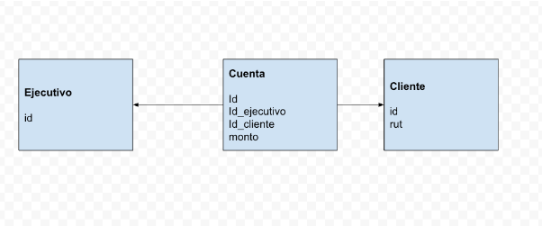

# Javascript Challenge

## Uso

- Correr con `node index.js`

## Instrucciones

- Considerar el siguiente modelo de datos para las preguntas:

## Preguntas

- Pregunta 1: Lo primero que necesito que hagas es que declares las cuentas:

  - Para esto, necesito que definas una variable con un arreglo de objetos con los datos de las cuentas según el modelo de datos entregado.
  - A modo de ejemplo, solo necesito dos objetos en el arreglo.
  - Puedes asignar los valores de las cuentas según lo estimes conveniente.

- Pregunta 2: Imagina que en la variable definida están todos los datos de las cuentas de la aplicación, supongamos 30 millones de objetos.

  - Necesito saber qué cuentas tienen un saldo mayor a 2.5 millones, y para esto, necesito que guardes el resultado en una nueva variable, que al igual que la variable definida en la pregunta anterior, tenga la misma estructura de datos, es decir, un arreglo de objetos con los datos de aquellas cuentas que tengan un saldo mayor a 2.5 millones.

- Pregunta 3: Necesito que definas una nueva variable con las cuentas ordenadas por monto, según el criterio que más te guste, ya sea creciente o decreciente.

- Pregunta 4: Necesito que declares un arreglo vacío en una nueva variable que represente a los clientes.

  - Imagina que ese arreglo de clientes contiene a todos los clientes de la aplicación, según la estructura de datos entregada en el modelo.

- Pregunta 5: Necesito que definas una nueva variable con un arreglo de objetos con los clientes que tengan alguna cuenta > 2.5 millones.

  - No importa que los clientes estén repetidos en ese arreglo.
  - Entregar una lista de ids de clientes NO cumple con el requerimiento.

- Pregunta 6: Para los clientes que tengan alguna cuenta mayor a 2.5 millones, necesito que declares un arreglo en una nueva variable, cuyos elementos sean la suma de los saldos de las cuentas para cada uno de ellos, o, en otras palabras, el saldo consolidado de sus cuentas.
